# FlexOrder CI/CD Pipeline Workflow Diagram

## Overview
This diagram illustrates the complete FlexOrder CI/CD pipeline, from triggers through test execution and cleanup, based on the actual GitHub Actions workflow implementation.

## Workflow Diagram

```mermaid
flowchart TD
    %% Triggers
    A[🔄 Workflow Triggers] --> B{Trigger Type}
    B -->|Manual| C[workflow_dispatch<br/>Manual execution]
    B -->|Push| D[Push to main/dev/qa branches]
    B -->|Plugin Update| E[repository_dispatch<br/>Types: flexorder, flexorder-ultimate]
    
    C --> F[Start CI Pipeline]
    D --> F
    E --> F
    
    %% Concurrency Control
    F --> G[🔒 Concurrency Control<br/>group: ci-flexorder-e2e-github-ref<br/>cancel-in-progress: true]
    
    %% Main Job Start
    G --> H[🏗️ Main Job: setup-wordpress<br/>runs-on: self-hosted]
    
    %% Repository Setup
    H --> I[📁 Checkout CI Workflow Repo<br/>actions/checkout@v4]
    I --> J[ℹ️ Display Workflow Information<br/>Branch, Trigger, Plugin info]
    
    %% Environment Setup Phase
    J --> K[🟢 Setup Node.js<br/>Version: 18, cache: npm]
    K --> L[💾 Cache Docker Layers<br/>Path: .buildx-cache]
    L --> M[🎭 Enhanced Playwright Cache<br/>ms-playwright + npm cache]
    M --> N[📦 Install Dependencies<br/>npm ci]
    N --> O[🎭 Install Playwright<br/>npx playwright install --with-deps]
    O --> P[🔧 Install Additional Dependencies<br/>jq, curl verification]
    
    %% Docker Environment Setup
    P --> Q[🧹 Clean up Existing Containers<br/>docker compose down -v --remove-orphans]
    Q --> R[🐳 Start WordPress with Docker<br/>docker-compose.fresh-wordpress.yml]
    R --> S[⏳ Wait for Services<br/>MySQL + WordPress with retry logic]
    S --> T{Services Ready?}
    T -->|No| U[🔄 Retry with exponential backoff<br/>Up to 12 retries]
    U --> T
    T -->|Yes| V[✅ Services Ready]
    
    %% Environment Variables Setup
    V --> W[⚙️ Setup Environment Variables<br/>URLs, credentials, API keys]
    
    %% Plugin Management
    W --> X[🔑 Mint GitHub App Token<br/>Access to WPPOOL repos]
    X --> Y[🌿 Determine Plugin Branch<br/>Branch mapping logic]
    Y --> Z{Trigger Type?}
    Z -->|repository_dispatch| AA[📦 Use plugin branch from payload<br/>Repository: payload.repository<br/>Branch: payload.branch<br/>SHA: payload.sha]
    Z -->|push/manual| BB[📦 Map CI branch to plugin branch<br/>main→main, dev→dev, qa→dev<br/>default→main fallback]
    
    AA --> CC[📥 Download FlexOrder Free<br/>From determined branch with fallback to main]
    BB --> CC
    CC --> DD[📥 Download FlexOrder Ultimate<br/>From determined branch with fallback to main]
    DD --> EE[📂 Copy Plugin Zips to Container<br/>docker cp flexorder.zip -> /tmp/<br/>docker cp flexorder-ultimate.zip -> /tmp/]
    
    %% WordPress Configuration
    EE --> FF[🔧 Install WordPress and Plugins<br/>Wait for container health]
    FF --> GG[🔧 Setup WordPress Core<br/>wp core install if needed]
    GG --> HH[🛒 Install & Activate WooCommerce<br/>wp plugin install woocommerce]
    HH --> II[🧹 Clean Existing FlexOrder Plugins<br/>Remove old plugin directories]
    II --> JJ[📦 Install FlexOrder Free<br/>wp plugin install --activate --force]
    JJ --> KK[📦 Install FlexOrder Ultimate<br/>wp plugin install --activate --force]
    KK --> LL[🔍 Verify Plugin Installation<br/>Check active plugins]
    LL --> MM{Plugins Active?}
    MM -->|No| NN[❌ Fail: Plugin activation error]
    MM -->|Yes| OO[✅ Plugins Successfully Installed]
    
    %% Environment Provisioning
    OO --> PP[🌱 Provision Environment & Seed Data<br/>npx ts-node scripts/setup-ci-environment.ts]
    PP --> QQ[🔑 Extract Generated API Keys<br/>From tests/utilities/api-keys.json]
    QQ --> RR[🔍 Validate Environment<br/>WordPress access, plugins, API keys]
    RR --> SS{Environment Valid?}
    SS -->|No| TT[⚠️ Continue with warnings<br/>Some validations skipped due to redirects]
    SS -->|Yes| UU[✅ Environment Ready for Testing]
    TT --> UU
    
    %% Test Execution Phase
    UU --> VV[🧪 Run E2E Tests<br/>npm run test:ci:full<br/>Timeout: 60 minutes]
    VV --> WW{Tests Pass?}
    WW -->|Pass| XX[✅ Tests Successful]
    WW -->|Fail/Timeout| YY[❌ Tests Failed<br/>Capture failure details & artifacts]
    
    %% Results Handling (Always Run)
    XX --> ZZ[📤 Upload Test Results<br/>Always run - 7 days retention<br/>test-results/, playwright-report/, api-keys.json]
    YY --> ZZ
    YY --> AAA[📸 Upload Screenshots<br/>On failure only<br/>test-results/**/*.png]
    
    %% Email Notification (Conditional)
    ZZ --> BBB{Email Configured?}
    AAA --> BBB
    BBB -->|Yes & Failure| CCC[📧 Send Failure Email<br/>SMTP with attachments<br/>HTML report + JUnit results]
    BBB -->|No/Success| DDD[Skip Email]
    CCC --> DDD
    
    %% Cleanup Phase (Always runs)
    DDD --> EEE[🧹 Cleanup Job<br/>Always runs - needs: setup-wordpress<br/>runs-on: self-hosted]
    EEE --> FFF[📁 Checkout Repository<br/>actions/checkout@v4]
    FFF --> GGG[🐳 Stop Docker Services<br/>docker compose down -v --remove-orphans]
    GGG --> HHH[🗑️ Clean Docker System<br/>docker system prune -f --volumes]
    HHH --> III[✅ Pipeline Complete]
    
    %% Error States
    NN --> ZZFAIL[🚨 Pipeline Failed]
    
    %% Notes
    note1[📝 Note: Cleanup job runs regardless of test results]
    EEE -.-> note1
    
    %% Styling
    classDef startEnd fill:#e1f5fe,stroke:#0277bd,stroke-width:3px
    classDef process fill:#f3e5f5,stroke:#7b1fa2,stroke-width:2px
    classDef decision fill:#fff3e0,stroke:#ef6c00,stroke-width:2px
    classDef success fill:#e8f5e8,stroke:#2e7d32,stroke-width:2px
    classDef error fill:#ffebee,stroke:#c62828,stroke-width:2px
    classDef setup fill:#e0f2f1,stroke:#00695c,stroke-width:2px
    classDef docker fill:#e3f2fd,stroke:#1565c0,stroke-width:2px
    classDef plugin fill:#fff9c4,stroke:#f57f17,stroke-width:2px
    classDef cache fill:#fce4ec,stroke:#ad1457,stroke-width:2px
    classDef note fill:#f5f5f5,stroke:#757575,stroke-width:1px,stroke-dasharray: 5 5
    
    class A,F,III startEnd
    class I,J,N,O,P,GG,HH,PP,QQ,RR,VV,ZZ,FFF process
    class B,T,MM,SS,WW,BBB decision
    class XX,V,OO,UU,EEE success
    class NN,YY,ZZFAIL error
    class K,W,X setup
    class Q,R,S,G,GGG,HHH docker
    class Y,Z,AA,BB,CC,DD,EE,FF,II,JJ,KK,LL plugin
    class L,M cache
    class C,D,E,TT,AAA,CCC,DDD process
    class note1 note
```



## Workflow Phases Breakdown

### 1. **Trigger Phase** 🔄
- **Manual**: Via GitHub UI (`workflow_dispatch`)
- **Push**: Push to `main`, `dev`, or `qa` branches
- **Plugin Updates**: Repository dispatch types: `flexorder` and `flexorder-ultimate`
- **Scheduled**: Optional cron jobs (currently commented out)
- **Concurrency**: Cancel previous runs for same branch (`ci-flexorder-e2e-${{ github.ref }}`)

### 2. **Setup Phase** 🏗️
- **Runner**: Self-hosted Windows runner (`DESKTOP-NQ3FLNF`)
- **Node.js**: Version 18 with npm caching
- **Dependencies**: npm ci, Playwright with system dependencies
- **Tools**: jq, curl verification and installation
- **Caching**: Docker layers, Playwright binaries, npm packages

### 3. **Docker Environment** 🐳
- **Cleanup**: Remove existing containers and volumes
- **Startup**: Docker Compose with WordPress, MySQL, PhpMyAdmin
- **Health Checks**: MySQL ping, WordPress HTTP checks with exponential backoff retry
- **Service Validation**: Up to 12 retries with increasing delays

### 4. **Authentication & Branch Logic** 🔑
- **GitHub App Token**: Mint token for accessing WPPOOL repositories with installation retrieval
- **Token Scope**: Limited to `flexorder` and `flexorder-ultimate` repositories
- **Branch Mapping**:
  - `main` branch → Use `main` branch plugins (production)
  - `dev` branch → Use `dev` branch plugins (development)  
  - `qa` branch → Use `dev` branch plugins (QA testing)
  - `default/other` → Use `main` branch plugins (fallback)
  - Repository dispatch → Use exact branch from `client_payload.branch`

### 5. **Plugin Management** 📦
- **Download Strategy**: GitHub API zipball from determined branch with fallback to main
- **FlexOrder Free**: Download from `WPPOOL/flexorder` repository
- **FlexOrder Ultimate**: Download from `WPPOOL/flexorder-ultimate` repository
- **Fallback Logic**: If branch fails, automatically fallback to main branch
- **Container Transfer**: Copy plugin zips to WordPress container `/tmp/` directory

### 6. **WordPress Configuration** 🔧
- **Container Health**: Wait for WordPress container to be fully healthy (30 attempts, 10-second intervals)
- **WP-CLI Setup**: Download and install wp-cli if not available in container
- **Core Installation**: Install WordPress core using wp-cli if not already installed
- **Site Configuration**: Set siteurl and home options to `http://localhost:8080`
- **WooCommerce**: Install and activate latest WooCommerce plugin
- **Plugin Cleanup**: Remove existing FlexOrder plugin directories to avoid conflicts
- **Plugin Installation**: Install both plugins with `--force` and `--activate` flags
- **Verification**: Check that plugins are successfully activated using wp plugin list

### 7. **Environment Provisioning** 🌱
- **Data Seeding**: Run `setup-ci-environment.ts` script via `npx ts-node`
- **API Key Generation**: Create WooCommerce API consumer key/secret pairs
- **Configuration**: Setup test data, users, products, etc.
- **Key Extraction**: Extract generated API keys from `tests/utilities/api-keys.json`
- **Validation**: Verify WordPress access, plugin status, API availability
- **Graceful Handling**: Continue with warnings if some validations fail due to redirects

### 8. **Test Execution** 🧪
- **Command**: `npm run test:ci:full`
- **Timeout**: 60 minutes maximum execution time
- **Environment Variables**: Full WordPress and WooCommerce configuration
- **Parallel Execution**: Auto-detected worker count
- **Error Handling**: Comprehensive failure capture and reporting

### 9. **Results & Artifacts** 📊
- **Test Results**: Always upload (7-day retention)
  - `test-results/` directory with detailed logs
  - `playwright-report/` directory with HTML reports
  - `tests/utilities/api-keys.json` for debugging
- **Screenshots**: Upload on failure only (PNG files)
- **Email Notifications**: Conditional SMTP email with attachments on failures

### 10. **Cleanup** 🧹
- **Always Runs**: Separate cleanup job that runs regardless of test results
- **Docker Cleanup**: Stop containers, remove volumes, prune system
- **Resource Management**: Ensures no leftover resources for next run

## Key Features

### **Intelligent Branch Mapping** 🌿
- **Production Flow**: `main` branch tests with main branch plugins
- **Development Flow**: `dev` branch tests with dev branch plugins  
- **QA Flow**: `qa` branch tests with dev branch plugins
- **Plugin Updates**: Direct branch specification from repository dispatch

### **Robust Error Handling** 🛡️
- **Exponential Backoff**: Service startup retries with increasing delays
- **Fallback Logic**: Plugin download fallback from target branch to main
- **Graceful Degradation**: Continue with warnings if non-critical validations fail
- **Comprehensive Logging**: Detailed output for debugging failures

### **Advanced Caching** 💾
- **Docker Layer Caching**: Speed up container builds
- **Playwright Binary Caching**: Avoid re-downloading browser binaries
- **NPM Package Caching**: Cache node_modules between runs
- **Multi-level Cache Keys**: OS, Node version, and dependency hash based

### **Security & Authentication** 🔒
- **GitHub App Authentication**: Secure access to private repositories
- **Repository Scoping**: Token limited to specific repositories
- **Secret Management**: Proper handling of SMTP and API credentials
- **Least Privilege**: Minimal required permissions

## Environment Configuration

### **Runtime Environment Variables**
```yaml
NODE_VERSION: '18'
DOCKER_BUILDKIT: 1
COMPOSE_DOCKER_CLI_BUILD: 1
PLAYWRIGHT_TIMEOUT: 3600000  # 60 minutes in milliseconds
```

### **Test Environment Variables**
```yaml
CI: true
SITE_URL: http://localhost:8080
PLAYWRIGHT_BASE_URL: http://localhost:8080
ADMIN_PANEL_URL: http://localhost:8080/wp-admin/
USER_NAME: admin
PASSWORD: admin123
WOOCOMMERCE_CONSUMER_KEY: <generated>
WOOCOMMERCE_CONSUMER_SECRET: <generated>
GOOGLE_SHEET_URL: <optional-secret>
SHEET_NAME: <optional-secret>
```

### **WordPress Configuration**
```yaml
DB_NAME: wordpress
DB_USER: wordpress  
DB_PASSWORD: wordpress
DB_HOST: mysql:3306
WP_URL: http://localhost:8080
WP_TITLE: FlexOrder Test
WP_ADMIN_USER: admin
WP_ADMIN_PASSWORD: admin123
WP_ADMIN_EMAIL: admin@example.com
```

## Docker Services

### **WordPress Container** (`flexorder-wordpress`)
- **Port**: 8080
- **Features**: Latest WordPress, WP-CLI pre-installed
- **Health Checks**: Container health status monitoring
- **Volumes**: Persistent WordPress files and uploads

### **MySQL Container** (`flexorder-mysql`)
- **Port**: 3306  
- **Version**: MySQL 8.0
- **Database**: `wordpress` with proper user permissions
- **Health Checks**: `mysqladmin ping` validation

### **PhpMyAdmin Container** (Optional)
- **Port**: 8081
- **Purpose**: Database administration and debugging
- **Connection**: Linked to MySQL service

## Plugin Installation Strategy

### **Source-Based Installation**
1. **Download**: GitHub API zipball from specific branch
2. **Transfer**: Copy to WordPress container `/tmp/` directory
3. **Install**: Use WP-CLI with `--force` and `--activate` flags
4. **Verify**: Check plugin activation status
5. **Cleanup**: Remove temporary files

### **Branch Selection Logic**
```yaml
repository_dispatch: Use client_payload.branch (from plugin repo)
main branch: Use main plugin branches (production)
dev branch: Use dev plugin branches (development)
qa branch: Use dev plugin branches (QA testing)  
default/other: Use main plugin branches (fallback)
download_fallback: Always fallback to main if target branch download fails
```

### **Plugin Verification**
- Active plugin list validation
- Plugin directory cleanup before installation
- Force installation to handle conflicts
- Comprehensive error reporting

## Test Execution Details

### **Test Suite**: E2E Full Test Suite
- **Command**: `npm run test:ci:full`
- **Timeout**: 60 minutes maximum (3600000ms in PLAYWRIGHT_TIMEOUT)
- **Parallelization**: Auto-detected based on system resources
- **Browsers**: Headless Chromium, Firefox, WebKit (configured)
- **Reporting**: JUnit XML, HTML reports, JSON results
- **Error Handling**: Comprehensive failure capture with exit codes

### **Test Environment**
- **WordPress**: Fresh installation with WooCommerce
- **Plugins**: Latest FlexOrder Free + Ultimate from specified branches
- **Data**: Seeded test data (products, customers, orders)
- **API**: Generated WooCommerce REST API credentials

### **Failure Handling**  
- **Screenshots**: Automatic capture on test failures
- **Traces**: Playwright execution traces for debugging
- **Logs**: Comprehensive console and network logs
- **Artifacts**: 7-day retention for debugging

## Repository Dispatch Payload

### **Plugin Update Payload Structure**
When triggered by plugin repository updates, the workflow receives:
```json
{
  "client_payload": {
    "repository": "flexorder" | "flexorder-ultimate",
    "branch": "main" | "dev" | "feature-branch",
    "sha": "commit-sha-hash",
    "pusher": "github-username"
  }
}
```

This payload is used to:
- Determine which plugin branch to download and test
- Display trigger information in workflow logs
- Track the exact commit being tested

## Secrets Required

### **GitHub App Authentication**
- `APP_ID`: GitHub App ID for repository access
- `APP_PRIVATE_KEY`: Private key for GitHub App authentication

### **Email Notifications (Optional)**
- `SMTP_SERVER`: SMTP server hostname
- `SMTP_PORT`: SMTP server port (default: 587)
- `SMTP_USERNAME`: SMTP authentication username
- `SMTP_PASSWORD`: SMTP authentication password
- `EMAIL_TO`: Recipient email for failure notifications

### **Google Sheets Integration (Optional)**
- `GOOGLE_SHEET_URL`: Google Sheets URL for test data logging
- `SHEET_NAME`: Target sheet name for results

## Cleanup Strategy

### **Always-Run Cleanup Job**
- **Dependency**: Requires `setup-wordpress` job completion
- **Execution**: Runs regardless of test success/failure  
- **Runner**: Same self-hosted runner for consistency

### **Cleanup Actions**
1. **Repository Checkout**: Fresh checkout for cleanup scripts
2. **Container Shutdown**: `docker compose down -v --remove-orphans`
3. **Volume Removal**: Remove all associated Docker volumes
4. **System Cleanup**: `docker system prune -f --volumes`
5. **Resource Verification**: Ensure complete cleanup

### **Resource Management**
- **No Leaks**: Prevents resource accumulation between runs
- **Clean State**: Each workflow starts with fresh environment
- **Storage Optimization**: Regular cleanup of unused Docker resources

This comprehensive CI/CD pipeline ensures reliable, reproducible testing of FlexOrder plugins with the latest development changes while maintaining clean environments and proper resource management.